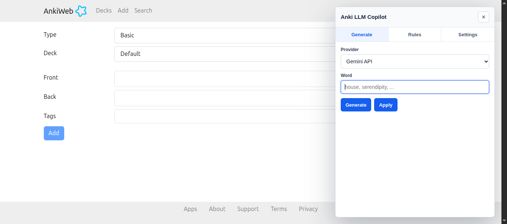

# Anki LLM Copilot

Chrome MV3 extension that adds a floating panel to AnkiWeb to generate text with Gemini or Groq and apply it to the editable card field.



## Local Installation

1. Open `chrome://extensions`.
2. Enable `Developer mode`.
3. Click `Load unpacked`.
4. Select this folder: `/path/to/anki-llm-copilot`.

## Usage

- Go to `https://ankiuser.net/add` or `https://ankiuser.net/edit/*`.
- Click the floating button `✦`.
- In **Settings**:
  - Save one or both API Keys:
    - **Gemini**: Google API Key (AIza...)
    - **Groq**: Groq API Key (gsk_...)
- In **Rules**, create rules to use as context for generation.
- In **Generate**:
  - Select the provider to use
  - Enter a word
  - Click **Generate** to create the content
  - Click **Apply** to insert it into Anki

The extension will insert the result into:

```html
<div class="form-control field" contenteditable="true"></div>
```

The selected LLM receives instructions to respond with simple HTML, and the extension sanitizes the result before inserting it.

## How It Works

The extension injects a high z-index floating panel into the Anki page. The panel has three tabs:

- **Generate**: choose the LLM provider, enter the word, generate the card content, preview it, and apply it to the Anki editable field.
- **Rules**: create reusable instructions that are sent as extra context to the model every time a word is generated.
- **Settings**: save the API keys used by Gemini and Groq.

API keys, the selected provider, and rules are stored in the browser `localStorage` for the current site.

## Rules Example

Rules are not generated text by themselves. They are context instructions for the model, so they should describe the structure, tone, and information that every generated card should include.

Example rule:

```text
Name: Reverse card structure

Description:
The generated content must start with the Spanish translation of the word in bold.
Then include the part of speech, such as noun, verb, adjective, or adverb.
After that, add a short explanation in simple English.
Finally, include an examples section with 2 short sentences using the word naturally.
Use simple HTML tags like <strong>, <em>, <ul>, <li>, and <br>.
Do not include markdown.
```

If the word is `house`, the model will receive both the word and this rule, so the answer should follow that structure before it is inserted into Anki.

## Supported LLMs

- **Gemini API**: Google Gemini 3.5 Flash
- **Groq API**: Llama 3.3 70B Versatile
